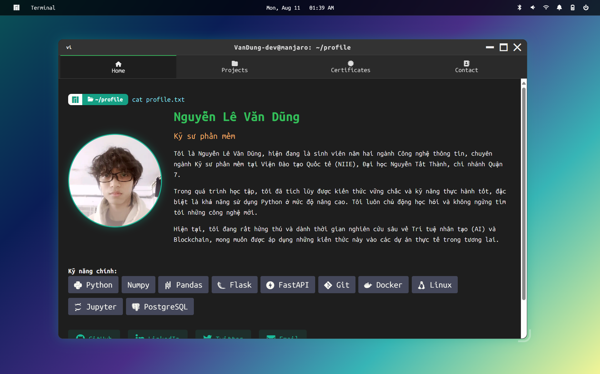

# 🖥️ VanDung-dev – Hồ sơ cá nhân dưới dạng Terminal Gnome Manjaro

> Một trải nghiệm tương tác hóa để giới thiệu lập trình viên như một kỹ sư Linux thực thụ.

---

## 🚀 Giới thiệu

Dự án **Profile-web** là một **hồ sơ cá nhân** (personal profile) được thiết kế theo phong cách **terminal Gnome trên hệ điều hành Manjaro Linux**. Giao diện mô phỏng dòng lệnh thực tế, đi kèm hiệu ứng hoạt họa, tab nội dung động, đa ngôn ngữ và khả năng tương tác, giúp bạn tiếp cận người xem bằng một phong cách kỹ thuật và độc đáo.

---


---

## 🧑‍💻 Mục tiêu

- Trình bày **kỹ năng lập trình**, các **dự án tiêu biểu**, **chứng chỉ chuyên môn**, và **thông tin liên hệ**.
- Tái hiện không gian làm việc quen thuộc của một kỹ sư phần mềm sử dụng Linux.
- Khẳng định phong cách làm việc “developer mindset” từ giao diện đến nội dung.

---

## 🧱 Công nghệ sử dụng

| Thành phần | Mô tả |
|-----------|-------|
| `HTML5 / CSS3` | Thiết kế hiện đại, responsive, hỗ trợ theme động |
| `Vanilla JavaScript` | Logic dòng lệnh, giao diện tương tác, chuyển đổi ngôn ngữ |
| `Zsh-style prompt` | Mô phỏng terminal thực với hiệu ứng `cd`, `neofetch`, `git` |
| `Dock + Gnome top bar` | Giao diện người dùng giống GNOME Shell thật |

---

## 🎯 Tính năng nổi bật

- ✨ **Mô phỏng terminal** với cửa sổ có thể thu nhỏ/phóng to/đóng.
- 🌐 **Hỗ trợ song ngữ**: 🇻🇳 Tiếng Việt và 🇺🇸 English.
- 💬 Nhập các lệnh thật như:
  - `cd profile/`
  - `neofetch`
  - `sudo pacman -Syu`
  - `git status`
- 🎨 **Tùy chọn theme màu sắc** (blue, green, red, yellow, default).
- 📱 **Tương thích trên thiết bị di động**, tự động điều chỉnh bố cục.

---

## 📂 Cấu trúc dự án

```
VanDung-dev-profile/
├── images           # Thư mục chứa ảnh
├── index.html       # Tệp HTML chính chứa cấu trúc nội dung
├── style.css        # Tùy chỉnh giao diện, dock, tab, theme
└── script.js        # Toàn bộ logic điều khiển giao diện tương tác
```

---

## 🔧 Cách triển khai

### ✅ Cách 1: Chạy cục bộ

```bash
git clone https://github.com/VanDung-dev/VanDung-dev-profile.git
cd VanDung-dev-profile
# Mở tệp index.html bằng trình duyệt
```

### ✅ Cách 2: Triển khai lên Internet

Bạn có thể sử dụng một trong các nền tảng hosting tĩnh sau:

- [GitHub Pages](https://pages.github.com/)
- [Netlify](https://netlify.com/)
- [Vercel](https://vercel.com/)

---

## 🛡️ Giấy phép

Dự án này được phát hành dưới **giấy phép tùy chỉnh cho hồ sơ cá nhân**. Vui lòng tham khảo tệp [`LICENSE`](./LICENSE) để biết chi tiết.

> Đây là sản phẩm cá nhân phục vụ mục đích học tập, giới thiệu kỹ năng và không được sử dụng lại toàn bộ cho mục đích thương mại mà không có sự cho phép bằng văn bản.

---

## 📬 Liên hệ

- **Tác giả**: Nguyễn Lê Văn Dũng
- **Email**: [dungnguyen2661@gmail.com](mailto:dungnguyen2661@gmail.com)
- **GitHub**: [VanDung-dev](https://github.com/VanDung-dev)
- **LinkedIn**: [dung-nguyen](https://www.linkedin.com/in/dung-nguyen-211bab348/)

---
## ❗️ Lưu ý:
- Hiện tại giao diện web có thể sẽ bị lỗi đối với `mobile`
---

> Nếu bạn thấy dự án này hữu ích hoặc truyền cảm hứng, hãy ⭐ trên GitHub hoặc chia sẻ với cộng đồng nhé!
